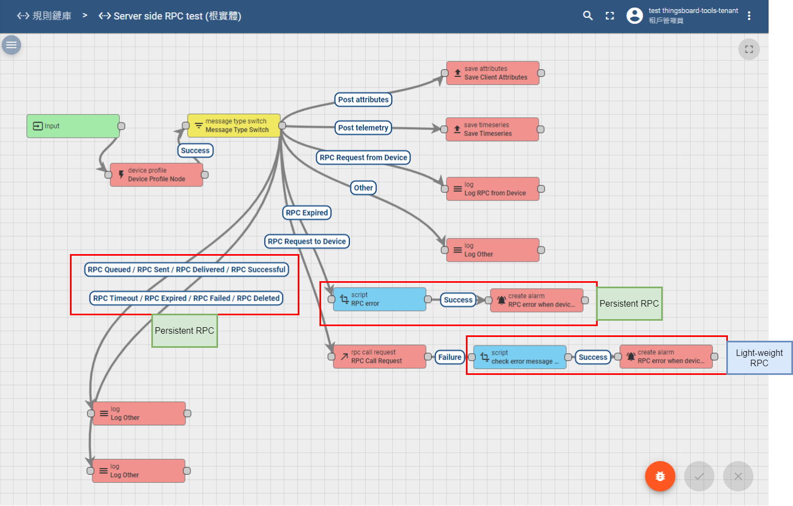
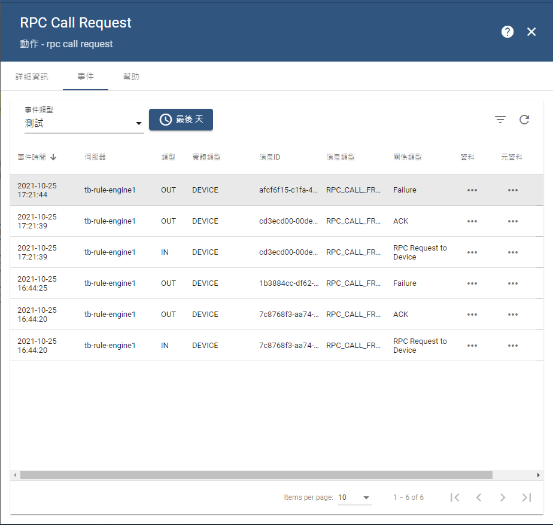
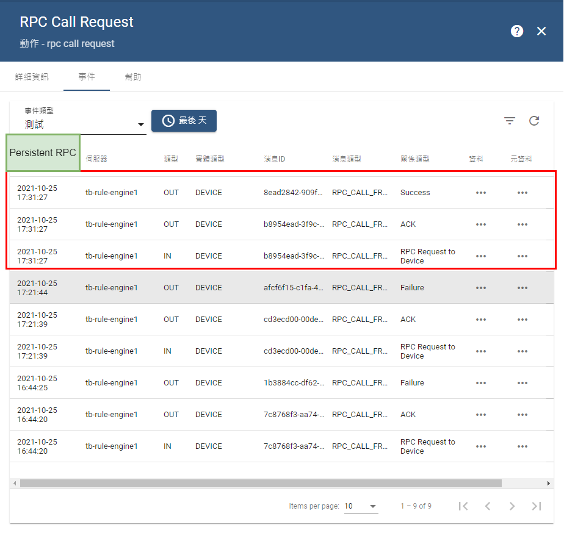

# RPC

type: other

# Server side RPC

## 特性比較

### L**ightweight** RPC

- 在 TB 3.3 之前的版本僅支援Lightweight RPC
- 此RPC的呼叫通常不會等待太久
- 等待時間 ≤ 30秒
- 消耗資源量較少，不存入DB

### [Persistent](https://thingsboard.io/docs/user-guide/rpc/#persistent-rpc) RPC

- TB 3.3 版本之後可使用 Persistent RPC
- 此RPC可以設置較長的等待時間
- 等待時間 ≥ 30秒
- 消耗資源量較大，會存入DB

## **Persistent RPC 介紹**

### 有七種狀態

- **QUEUED**
    - RPC 剛被建立並存在 DB 內
    - 此狀態下的 RPC 尚未將請求傳給 Client
    - 若裝置在線時，會嘗試發送 RPC
    - 默認情況下會一次發送全部的 RPC ([可修改設定](https://thingsboard.io/docs/user-guide/install/config/) “ACTORS_RPC_SEQUENTIAL”)
- **SENT**
    - TB 嘗試將 RPC 送到 Client
- **DELIVERED**
    - 裝置有收到 RPC 請求
- **SUCCESSFUL**
    - two-way RPC 有收到 Client 的回覆
- **TIMEOUT**
    - TB transport layer 檢測到 RPC timeout 時觸發
    - 預設情況下不會重試 RPC 請求， 並標記為 FAILED 狀態
    - 若 RPC 請求有設定重試次數則會嘗試重發請求 ([可設定最大上限](https://thingsboard.io/docs/user-guide/install/config/) “ACTORS_RPC_MAX_RETRIES”)
- **EXPIRED**
    - RPC 發送失敗，Client 沒有收到 RPC 命令或是 Client 未在時間內回覆
- **FAILED**
    - 在設定的重試次數期間，傳送 RPC 失敗

# 搭配 Rule chain 使用 (以下均用 two-way RPC)

## 使用情境

- Server 嘗試發送 RPC 請求給 Client
- RPC 請求可用 L**ightweight** 或是 **Persistent**
- 若 RPC 出現「可預期」的錯誤，針對該錯誤類型處理

## Rule chain

下圖為rule chain 的全部路徑，RPC Call Request 都會處理 Server side RPC，而後續的執行路線會有所差異。

## L**ightweight RPC**

Lightweight RPC 會執行的路徑如圖片上標記的位置，在 RPC Call Request node會嘗試發送 RPC 請求到Client，若沒有回應或是其他錯誤就會標記為 Failure。

### 錯誤訊息

若 RPC 請求失敗，在msg的物件內可以看見錯誤的類型

- TIMEOUT
    - Client MQTT 有連線但沒有回應
- NO_ACTIVE_CONNECTION
    - Client MQTT 沒有連線

## Persistent RPC

Persistent RPC 會執行的路徑如圖片上標記的位置，與 Lightweight RPC 不同的是 RPC 請求會直接標記為 Success。

在 Rule chain 上就可以針對 Persistent RPC 去做處理，可以使用的類型如下: 

- RPC Queued
- RPC Sent
- RPC Delivered
- RPC Successful
- RPC Timeout
- RPC Expired
- RPC Failed
- RPC Deleted

## 測試方式

若要使用此範例，可在 [github](https://github.com/a631953720/thingsboard-notes/tree/main/Server-side-RPC/rule-chain) 複製 rule chain 設定檔並匯入，此功能用的是 TB 3.3 的版本，新增好裝置後可以試著 Call two-way RPC 給裝置，觀察 Rule chain 的行為。